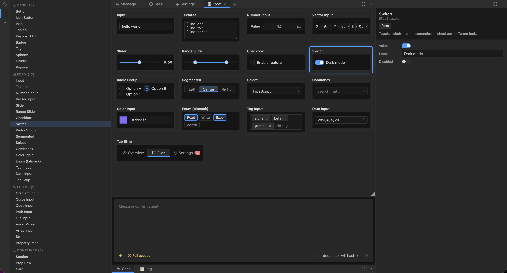

# editorframe

A zero-dependency, zero-build, Blender-style UI framework for building professional web editors.

[](https://www.npmjs.com/package/@gooooo/editorframe)
[](./LICENSE)

editorframe gives editor authors one small, consistent model for the parts that usually become messy: dock layouts, panels, toolbars, UI components, property inspectors, logs, settings, AI context, and user-approved changes.

You write panels and components. editorframe arranges them into a real editor.



---

## Why It Exists

Most editors are built from the same primitives:

- a file tree or asset browser
- a central editing surface
- an inspector
- a log or console
- toolbars, tabs, menus, settings
- optional AI assistance that can inspect context and propose changes

editorframe is designed around that shape. Instead of inventing custom layout code for every tool, you register reusable panels and components, then compose them with dock containers.

The result is simple enough for small internal tools and structured enough for large editor applications.

---

## Core Model

Everything is built from the same tree:

```text
Layout
└─ Dock
   ├─ Toolbar
   │  └─ toolbar component
   └─ Panel
      └─ component
```

- **Dock** is a split, mergeable, resizable rectangular area.
- **Panel** is a work unit inside a dock: editor, inspector, asset browser, log, settings, AI chat.
- **Component** is the render function behind everything, including panel content, toolbar items, tabs, buttons, and built-in UI.
- **Toolbar items are normal components**. Tabs have no privileged internal API.
- **Inactive panels are detached from the DOM**, not hidden with CSS, so tabbed editors keep state without making background panels participate in layout or paint.
- **The layout tree is JSON-serializable**, which makes persistence, pop-out windows, AI inspection, and controlled mutation straightforward.

The design goal is fewer concepts, fewer exceptions, and stronger composition. Complex editors should emerge from stable primitives, not one-off glue code.

---

## What You Can Build

- Multi-tab text, code, or data editors
- Game data, level, resource, and configuration editors
- Blender / Godot / VS Code style dock workspaces
- Internal tools, debugging panels, operation consoles, and visual tools
- AI-assisted editors where agents read selected context, generate changes, and wait for user approval before applying them

editorframe does not impose a business data model. Your application registers its own panels, data views, property renderers, AI tools, and context providers.

---

## Features

- **Zero build**: drop in `<script>` and CSS. It works from `file://`.
- **Zero dependencies**: no React, Vue, runtime framework, or bundler.
- **Single namespace**: all public APIs live under `window.EF`.
- **Blender-style dock layout**: split, merge, resize, drag tabs, pop out panels, focus mode, collapse docks.
- **Unified component registry**: panels, toolbar items, tabs, and built-in UI are all registered components.
- **50+ built-in UI components**: form, data, overlay, container, property editor, change review.
- **Small reactive core**: signal, effect, batch, onCleanup.
- **Panel communication bus**: decoupled pub/sub with automatic cleanup.
- **Theme system**: dark, dracula, light, plus semantic CSS tokens.
- **AI integration layer**: agents, tools, resources, context providers, rich prompts, change sets, permissions, and multiple model providers.

---

## AI Integration

AI is treated as an editor capability, not as a temporary application hook. The framework helps developers send precise editor context to an agent and expose controlled tools for reading, previewing, and applying changes.

The AI layer includes:

- **Agent runtime**: create agents, send messages, stop runs, inspect transcripts.
- **Provider connections**: OpenAI-compatible APIs, Anthropic, DeepSeek, Ollama, OpenRouter, Groq, Mistral, xAI, and local bridge transports.
- **Tool registry**: applications can expose tools such as `project.getSummary`, `table.updateRows`, or `asset.rename`.
- **Resources and targets**: selected objects, files, images, rows, nodes, or editor fragments can be attached to prompts as structured references.
- **Context providers**: capture the current panel, selection, or document state when an agent runs.
- **ChangeSet workflow**: AI-generated edits can be previewed, reviewed, applied, or rejected.
- **Permission model**: read, write, manage, and send operations can be controlled per agent and resource.

Example:

```js
EF.ai.registerTool('game.table.createEntity', {
  title: 'Create Entity',
  description: 'Create one entity in a game data table.',
  schema: {
    table: 'string',
    entity: 'object',
  },
  run: function (args, ctx) {
    // Read current project state and return a preview or safe result.
  },
  apply: function (args, ctx) {
    // Execute the write after the user approves it.
  },
})

EF.ai.registerContextProvider('current-selection', {
  capture: function (target, event, ctx) {
    return {
      panel: 'inspector',
      selection: window.currentSelectionSnapshot(),
    }
  },
})
```

The application defines what AI can see, what it can call, and which changes require approval. The agent does not need to guess the editor state or hard-code business logic.

---

## Installation

```html
<link rel="stylesheet" href="https://cdn.jsdelivr.net/npm/@gooooo/editorframe@1/dist/ef.css">
<script src="https://cdn.jsdelivr.net/npm/@gooooo/editorframe@1/dist/ef.js"></script>
```

```bash
npm install @gooooo/editorframe
```

After loading, the framework is available as `window.EF`.

---

## Quick Start

Register a component:

```js
EF.registerComponent('my-editor', {
  factory: function (propsSig, ctx) {
    var props = propsSig.peek() || {}
    var el = document.createElement('div')
    el.style.padding = '16px'
    el.textContent = 'Editing: ' + (props.file || 'untitled')
    return el
  },
})
```

Create a dock layout:

```js
var layout = EF.createDockLayout(document.getElementById('app'), {
  tree: EF.split('horizontal', [
    EF.dock({
      toolbar: { direction: 'top', items: [{ component: 'tab-standard' }] },
      panels: [
        EF.panel({ component: 'my-editor', title: 'main.js', props: { file: 'main.js' } }),
        EF.panel({ component: 'my-editor', title: 'style.css', props: { file: 'style.css' } }),
      ],
    }),
    EF.dock({
      toolbar: { direction: 'top', items: [{ component: 'tab-standard' }] },
      panels: [
        EF.panel({ component: 'log', title: 'Log', icon: 'list' }),
      ],
    }),
  ], [0.65, 0.35]),
})
```

That gives you a two-column, multi-tab, draggable editor shell ready for real panels.

---

## Components

A component is the smallest extension unit in editorframe. Once registered, it can be used as panel content or as a toolbar item.

```js
EF.registerComponent('my-component', {
  factory: function (propsSig, ctx) {
    var props = propsSig.peek() || {}
    var el = document.createElement('div')
    return el
  },

  defaults: function () {
    return { title: 'My Component', icon: 'box', props: {} }
  },

  dispose: function (el) {
    // Clean up timers, subscriptions, WebSockets, Workers, etc.
  },

  serialize: function (el) {
    return { scrollTop: el.scrollTop }
  },

  deserialize: function (el, state) {
    el.scrollTop = state.scrollTop || 0
  },
})
```

`props` must be a JSON-serializable plain object. Use `ctx.bus` for cross-panel communication and signals or context providers for editor state.

---

## Component Context

Every `factory(propsSig, ctx)` receives the same context shape:

```js
ctx.panel.title()
ctx.panel.setTitle('New Title')
ctx.panel.setDirty(true)
ctx.panel.updateProps({ file: 'b.js' })
ctx.panel.close()
ctx.panel.popOut()
ctx.panel.promote()

ctx.dock.panels()
ctx.dock.activeId()
ctx.dock.addPanel({ component: 'editor', title: 'New' })
ctx.dock.activatePanel(panelId)
ctx.dock.toggleFocus()

ctx.bus.emit('file:saved', { path: '/main.js' })
ctx.bus.on('file:saved', function (data) {})

ctx.active
ctx.onCleanup(function () {})
```

Static toolbar components do not have `ctx.panel`, but they do have `ctx.dock`. That is enough to build tabs, sidebars, dock menus, and custom toolbar controls with the same reactive model.

---

## Dock Patterns

Tabbed editor:

```js
EF.dock({
  toolbar: { direction: 'top', items: [{ component: 'tab-standard' }] },
  panels: [
    EF.panel({ component: 'editor', title: 'main.js' }),
    EF.panel({ component: 'editor', title: 'style.css' }),
  ],
})
```

Sidebar:

```js
EF.dock({
  toolbar: { direction: 'left', items: [{ component: 'tab-collapsible' }] },
  panels: [
    EF.panel({ component: 'file-tree', title: 'Files', icon: 'folder' }),
    EF.panel({ component: 'search', title: 'Search', icon: 'search' }),
    EF.panel({ component: 'settings', title: 'Settings', icon: 'settings' }),
  ],
})
```

Fixed inspector:

```js
EF.dock({
  panels: [
    EF.panel({ component: 'inspector', title: 'Inspector' }),
  ],
})
```

Preview panel:

```js
layout.addPanel('editor-dock', {
  component: 'editor',
  title: 'preview.js',
  props: { file: 'preview.js' },
}, { transient: true })

ctx.panel.promote()
```

---

## Built-in UI

`EF.ui.*` provides 50+ components built around caller-owned signals:

```js
var name = EF.signal('world')
var input = EF.ui.input({ value: name, placeholder: 'Name' })
var button = EF.ui.button({
  label: 'Greet',
  onClick: function () { alert('Hello ' + name()) },
})
```

- **Base**: button / iconButton / icon / tooltip / popover / badge / tag / spinner / divider
- **Form**: input / textarea / numberInput / vectorInput / slider / checkbox / switch / select / combobox / colorInput / dateInput / enumInput / tagInput
- **Editor**: gradientInput / curveInput / codeInput / pathInput / fileInput / assetPicker
- **Container**: section / propRow / card / scrollArea / tabPanel
- **Data**: list / tree / table / breadcrumbs / progressBar
- **Overlay**: menu / modal / drawer / alert / toast
- **Schema-driven**: propertyEditor / propertyPanel / TypeConfig / renderer registry
- **AI**: chat, agents, transcript, changeReview, rich prompt resources

---

## Runtime API

`createDockLayout` returns a layout handle:

```js
layout.addPanel(dockId, { component: 'editor', title: 'New' })
layout.removePanel(panelId)
layout.activatePanel(panelId)
layout.movePanel(panelId, targetDockId)
layout.promotePanel(panelId)
layout.splitDock(dockId, 'horizontal', 'after', 0.5)
layout.mergeDocks(winnerId, loserId)
layout.tree()
layout.setTree(nextTree)
layout.subscribe(function (tree) {})
```

You can also operate on the immutable tree directly:

```js
EF.addPanel(tree, dockId, partial, opts)
EF.removePanel(tree, panelId)
EF.activatePanel(tree, panelId)
EF.movePanel(tree, panelId, dstDockId)
EF.updatePanel(tree, panelId, patch)
EF.splitDock(tree, dockId, dir, side, ratio, opts)
EF.mergeDocks(tree, winnerId, loserId)
```

---

## Themes

Built-in themes: `dark`, `dracula`, and `light`.

```js
EF.theme.set('dark')
EF.theme.set('dracula')
EF.theme.set('light')
```

Custom themes should start with semantic tokens:

```css
:root {
  --ef-surface-panel: #1f2329;
  --ef-surface-field: #171a20;
  --ef-text-primary: #f3f6fb;
  --ef-text-muted: #8b95a5;
  --ef-brand: #569eff;
  --ef-state-danger: #ff5c5c;
  --ef-r-2: 8px;
}
```

---

## Local Development

```bash
git clone https://gitee.com/lazygoo/editor-frame.git
cd editor-frame
node tools/build.mjs --watch
npx http-server -p 5570
```

Open `http://localhost:5570`.

Changes under `src/` must be rebuilt into `dist/ef.js` and `dist/ef.css`. Files under `demo/` are loaded directly by the demo page.

Checks:

```bash
npm run check
npm run check:dist
```

---

## License

[MIT](./LICENSE) © gooooo

---

## More

- [`AGENTS.md`](./AGENTS.md) — architecture, data model, and project constraints
- [`doc/editor_style.html`](https://gitee.com/lazygoo/editor-frame/blob/master/doc/editor_style.html) — visual palette reference
- [`index.html`](https://gitee.com/lazygoo/editor-frame/blob/master/index.html) — component browser demo
