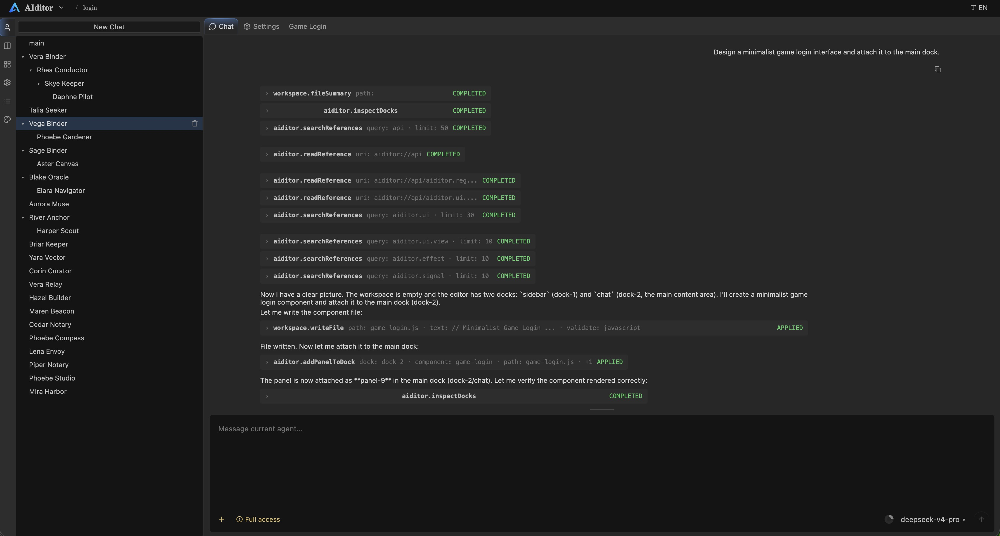
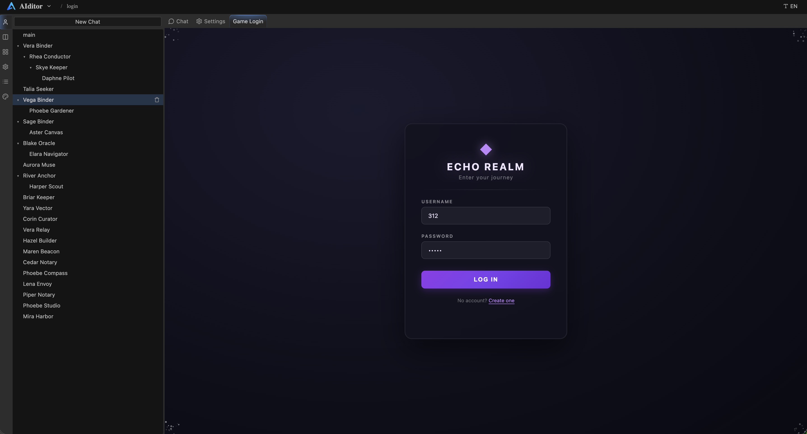

<p align="center">
  
</p>

<h1 align="center">AIditor</h1>

<p align="center">
  A pure frontend UI framework for building editors, with built-in AI Agent capabilities.
</p>

[](https://www.npmjs.com/package/@gooooo/aiditor)
[](./LICENSE)
[](./package.json)
[](./dist)

AIditor gives host applications the shared foundation most serious editor UIs
need: a Blender-style dock layout, panel/component runtime, themeable UI
controls, workspace contracts, optional AI agents, and optional extension
loading. It is plain browser JavaScript: no framework, no bundler, no module
system, and no runtime dependencies.





```html
<div id="app" style="height:100vh"></div>
<link rel="stylesheet" href="https://cdn.jsdelivr.net/npm/@gooooo/aiditor@1/dist/aiditor-core.css">
<script src="https://cdn.jsdelivr.net/npm/@gooooo/aiditor@1/dist/aiditor-core.js"></script>
<script>
aiditor.registerComponent('demo.editor', {
  defaults: function () {
    return { title: 'Editor', icon: 'file-text', props: { file: 'main.js' } }
  },
  factory: function (propsSig, ctx) {
    var root = document.createElement('div')
    root.style.cssText = 'height:100%;min-height:0;padding:12px;box-sizing:border-box'
    ctx.onCleanup(aiditor.effect(function () {
      root.textContent = 'Editing ' + ((propsSig() || {}).file || 'untitled')
    }))
    return root
  },
})

var tree = aiditor.split('horizontal', [
  aiditor.dock({
    name: 'main',
    toolbar: { direction: 'top', items: [{ component: 'tab-standard' }] },
    panels: [
      aiditor.panel({ component: 'demo.editor', title: 'main.js', props: { file: 'main.js' } }),
      aiditor.panel({ component: 'demo.editor', title: 'style.css', props: { file: 'style.css' } }),
    ],
  }),
  aiditor.dock({
    name: 'side',
    toolbar: { direction: 'top', items: [{ component: 'tab-compact' }] },
    panels: [aiditor.panel({ component: 'log', title: 'Log', icon: 'list' })],
  }),
], [0.7, 0.3])

aiditor.createDockLayout(document.getElementById('app'), {
  tree: tree,
  dockMenu: true,
})
</script>
```

## Why AIditor

Editor applications often rebuild the same infrastructure before they can work
on their actual domain: docks, tabs, toolbars, property panels, settings,
themes, logs, command surfaces, workspace access, and now AI operations.
AIditor packages those generic editor primitives without turning them into a
specific editor product.

- **Pure frontend**: classic `<script>` files, IIFEs, and a single
  `window.aiditor` namespace.
- **Zero dependencies**: no React, Vue, Monaco, router, bundler, or runtime
  package dependency.
- **Zero build for consumers**: use the committed `dist/` files from npm,
  jsDelivr, or a local checkout.
- **Blender-style layout**: immutable split tree, resizable docks, merge/split
  interactions, tabbed panels, and pop-out windows.
- **Detached inactive panels**: inactive panel DOM is removed from layout and
  paint while JS/DOM state is preserved for fast tab switching.
- **Optional AI Host**: agents, providers, tools, context references,
  operations, permissions, ChangeSet review, and compaction.
- **Optional Extension Runtime**: package, review, install, disable, and
  uninstall contributions into the existing registries.

## Mental Model

AIditor has one UI registration unit: `Component`.

```text
Layout
`-- Dock
    |-- Toolbar
    |   `-- Component
    `-- Panel
        `-- Component
```

Panels and toolbar items are plain data records that reference registered
components by name. Docks own geometry and active-panel state. Components own
rendered UI. Host applications own project formats, domain data, persistence,
privileged bridges, and application shortcuts.

## Packages

Install from npm:

```bash
npm install @gooooo/aiditor
```

Or load directly in the browser:

```html
<link rel="stylesheet" href="https://cdn.jsdelivr.net/npm/@gooooo/aiditor@1/dist/aiditor-full.css">
<script src="https://cdn.jsdelivr.net/npm/@gooooo/aiditor@1/dist/aiditor-full.js"></script>
```

Published files are intentionally small and runtime-only:

| Bundle | Includes | Use When |
| --- | --- | --- |
| `aiditor-kernel` | core services, component registry, tree, dock runtime, dock CSS | You want the smallest dock/component runtime. |
| `aiditor-ui` | UI widgets and built-in panel add-ons | You already loaded Kernel and want `aiditor.ui.*`. |
| `aiditor-ai` | AI Host and Extension Runtime | You already loaded Kernel/UI and want AI or extensions. |
| `aiditor-core` | Kernel + UI | You want the classic editor framework bundle. |
| `aiditor-full` | Kernel + UI + AI Host + Extension Runtime | You want everything in one file. |
| `aiditor` | Core alias | You want the short classic path. |

## Core Concepts

### Components

```js
aiditor.registerComponent('example.panel', {
  defaults: function () {
    return { title: 'Example', icon: 'box', props: {} }
  },
  factory: function (propsSig, ctx) {
    var root = document.createElement('div')
    root.textContent = 'Hello from AIditor'
    return root
  },
  dispose: function (root) {},
  serialize: function (root) { return {} },
  deserialize: function (root, state) {},
})
```

Component rules are deliberately plain:

- props are JSON-serializable data;
- `propsSig.peek()` is for one-shot reads;
- `propsSig()` inside `aiditor.effect(...)` is reactive;
- `ctx.onCleanup(...)` owns effects, timers, subscriptions, and overlays;
- panel roots should fit resizable docks with `height:100%` and `min-height:0`.

### Component Context

Every component receives `ctx`:

```js
ctx.panel.title()
ctx.panel.setTitle('New Title')
ctx.panel.setDirty(true)
ctx.panel.updateProps({ file: 'next.js' })
ctx.panel.close()
ctx.panel.popOut()

ctx.dock.panels()
ctx.dock.activeId()
ctx.dock.addPanel({ component: 'example.panel', title: 'New' })
ctx.dock.activatePanel(panelId)
ctx.dock.toggleFocus()

ctx.bus.emit('topic', payload)
ctx.bus.on('topic', function (payload) {})

ctx.active
ctx.onCleanup(function () {})
```

Static toolbar components receive `ctx.dock` but no `ctx.panel`. Dynamic toolbar
items contributed by the active panel receive both.

### Layout Runtime

`createDockLayout` returns the runtime handle:

```js
layout.addPanel(dockIdOrName, partialPanel, opts)
layout.removePanel(panelId)
layout.activatePanel(panelId)
layout.promotePanel(panelId)
layout.movePanel(panelId, targetDockIdOrName, targetIndex)
layout.splitDock(dockIdOrName, 'horizontal', 'after', 0.5)
layout.mergeDocks(winnerDockIdOrName, loserDockIdOrName)
layout.tree()
layout.setTree(nextTree)
layout.subscribe(function (tree) {})
layout.destroy()
```

The same immutable tree helpers are also available as pure functions:

```js
aiditor.addPanel(tree, dockId, partial, opts)
aiditor.removePanel(tree, panelId)
aiditor.activatePanel(tree, panelId)
aiditor.movePanel(tree, panelId, targetDockId, targetIndex)
aiditor.movePanelToSplit(tree, panelId, targetDockId, direction, side, ratio)
aiditor.splitDock(tree, dockId, direction, side, ratio, opts)
aiditor.mergeDocks(tree, winnerDockId, loserDockId)
```

### UI Library

`aiditor.ui.*` provides signal-first controls and editor-focused widgets:

```js
var name = aiditor.signal('world')
var input = aiditor.ui.input({ value: name, placeholder: 'Name' })
var button = aiditor.ui.button({
  text: 'Greet',
  onClick: function () { alert('Hello ' + name()) },
})
```

The UI layer includes base controls, form inputs, editor inputs, containers,
virtualized data views, overlays, property forms, settings UI, tab/log panels,
and the generic Inspector panel.

### Inspector

Inspector is provider-based. Editor surfaces select typed targets; domain code
describes how those targets become editable fields.

```js
aiditor.inspector.registerProvider('app.node', {
  inspect: function (targets) {
    return {
      schema: { name: { type: 'string' }, visible: { type: 'bool' } },
      values: targets.map(function (target) { return nodeStore.get(target.id) }),
      write: function (field, change, ctx) {
        ctx.targets.forEach(function (target, index) {
          nodeStore.patch(target.id, {
            [field]: ctx.valueForChange(change, target, index, ctx),
          })
        })
      },
    }
  },
})
```

Domain validation, undo history, persistence, and object semantics stay in the
host app.

### Themes

Built-in themes:

```js
aiditor.theme.set('dark')
aiditor.theme.set('dracula')
aiditor.theme.set('harbor')
aiditor.theme.set('light')
```

Custom themes should start from semantic authoring tokens such as
`--aiditor-surface-*`, `--aiditor-text-*`, `--aiditor-stroke-*`,
`--aiditor-brand`, and `--aiditor-state-*`.

## Built-In AI Host

The optional AI Host is a framework layer for editor-aware agents. It keeps the
model-facing surface small:

```text
Agent
Tool
Context Reference
Operation
ChangeSet
```

Tools expose actions to the model:

```js
aiditor.ai.tools.register('workspace.summarizeOpenFile', {
  title: 'Summarize Open File',
  description: 'Read the active file summary.',
  schema: { type: 'object', properties: {} },
  permissions: ['tool.call'],
  run: function (input, ctx) {
    return { text: 'summary' }
  },
})
```

Context references expose bounded readable state. Operations expose previewable
and applyable mutations. ChangeSets group reviewed changes. Permission checks,
workspace writes, operation apply, extension install, and host-adapter calls all
go through one resolver.

`aiditor-ai` and `aiditor-full` also include built-in authoring skills:

- `aiditor.runtime-authoring`: for agents running inside a live AIditor host,
  editing workspace files and mounting panels into current docks.
- `aiditor.library-authoring`: for agents using AIditor as a library in a
  repository or host app.

Generated API and skill references are available to agents through
`aiditor://api` and `aiditor://skills`.

## Extension Runtime

Extensions package contributions into existing registries:

```text
components
dock panels
tools
context providers
reference providers
operations
settings
commands
menus
```

An extension does not create a second component model or AI model. Install means
registering contributions with `owner: "extension:<id>"`; disable/uninstall
removes that owner from the registries.

## Design Principles

- **Small kernel, optional layers**: Kernel stays generic; UI, AI, and
  extensions are layered on top.
- **Host apps own product decisions**: project formats, domain data,
  persistence, menus, app shortcuts, and privileged bridges stay outside the
  framework.
- **One component model**: panels, toolbar items, and built-ins all resolve
  through registered components.
- **Stateful but efficient panels**: inactive panels are detached from the DOM,
  not hidden with CSS.
- **File-first AI authoring**: durable generated UI should live in workspace
  files; dock data references registered component names.
- **No hidden build step**: generated `dist/` files are committed and published.

## Local Development

```bash
git clone https://gitee.com/lazygoo/aiditor.git
cd aiditor
node tools/build.mjs --watch
npx http-server -p 5570
```

Open `http://localhost:5570`.

After changing `src/`, rebuild and test:

```bash
node tools/build.mjs
npm run check
npm run check:dist
```

`dist/aiditor-api.json` and `doc/api/*` are generated from structured comments
in `src/`.

## Documentation

- [Design index](./doc/README.md)
- [Architecture](./doc/architecture.md)
- [Core](./doc/core.md)
- [UI and dock runtime](./doc/ui.md)
- [AI Host](./doc/ai.md)
- [Extension Runtime](./doc/extensions.md)
- [Generated API docs](./doc/api/index.md)
- [Runtime authoring skill](./doc/skill/aiditor-runtime-authoring/SKILL.md)
- [Library authoring skill](./doc/skill/aiditor-library-authoring/SKILL.md)

## License

[MIT](./LICENSE) (c) gooooo
